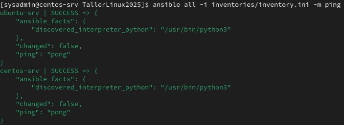
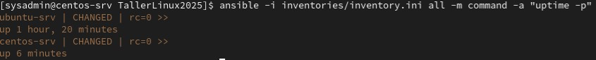
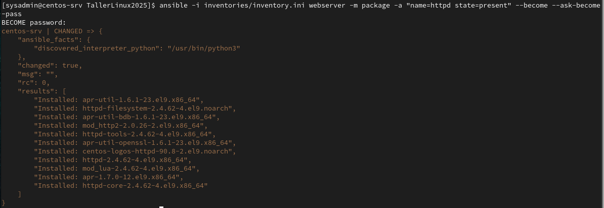

# EVALUACIÓN Obligatorio

| **GRUPO** | M3A N3A |
| **FECHA** | 24/02/2025 |
| **MATERIA** | Taller de Servidores Linux |
| **CARRERA** | All - ASA |
| **ESTUDIANTES** | Gonzalo Gutierrez - Sebastian Sequeira |

---

## 1. Inventario
Se genera el archivo inventories/inventory.ini con un host Ubuntu y host un host CentOS, definiendo para ambos una IP fija.
Se generan tres grupos llamdos "ubuntu", "centos" y "webserver". El contenido del archivo "inventory.ini" es el siguiente:

```bash
[centos]
centos1 ansible_host=192.168.1.28

[ubuntu]
ubuntu1 ansible_host=192.168.1.29

[linux:children]
centos
ubuntu

[webserver]
centos1

[linux:vars]
ansible_user=sysadmin
```
Se prueba conectividad con el comando:
```bash
ansible all -i inventories/inventory.ini -m ping
```



---

## 2. Comandos ad-hoc
Verifica el tiempo de actividad (uptime) en todos los servidores.
```bash
ansible -i inventories/invetory.ini all -m command -a "uptime -p"
```


Instala apache en los servidores web. 
```bash
ansible -i inventories/invetory.ini webserver -m package -a "name=httpd state=present" --become --ask-become-pass
```


Recupera el uso de espacio en disco de los servidores ubuntu.
```bash
ansible -i inventories/invetory.ini all -m command -a "df -h"
```


## 3. PlayBooks
### web_setup.yml
Este PlayBook instala apache en los servidores del grupo "webserver", crea un virtualserver "www.ejemplo.com.uy", permite el tráfico HTTP, despliega un archivo "index.html" el cual muestra datos del servidor.
El contenido del PlayBook es el siguiente:

```bash
---
- name: Agrego un virtual host
  hosts: webserver
  become: true

  tasks:

  - name: Install apache(httpd)
    ansible.builtin.yum:
      name: httpd
      state: present

  - name: Servicio apache(httpd) iniciado
    ansible.builtin.systemd_service:
      name: httpd
      state: started
      enabled: true

  - name: Agregar registro al archivo host
    ansible.builtin.lineinfile:
      path: /etc/hosts
      line: "{{ ansible_host }} www.ejemplo.com.uy"
      state: present
    #Esto ejecuta localmente pero lo hace por ssh:
    delegate_to: localhost
    #Esto le dice que no se conecte por SSH a localhost sino que lo ejecute local
    connection: local

  - name: Existe archivo de conf
    ansible.builtin.lineinfile:
      path: /etc/httpd/conf/httpd.conf
      line: "IncludeOptional /etc/httpd/vhost.d/*.conf"
    notify: Reiniciar apache

  - name: Existe directorio para configurar Virtualhost
    ansible.builtin.file:
      path: /etc/httpd/vhost.d
      state: directory
      owner: root
      group: root
      mode: '0755'

  - name: Existe directorio para alojar el sitio
    ansible.builtin.file:
      path: "/var/www/ejemplo/html"
      state: directory
      owner: apache
      group: apache
      mode: '0755'
   
  - name: Configuracion de VirtualHost
    ansible.builtin.template:
      src: ./templates/Virtualhost.j2
      dest: "/etc/httpd/vhost.d/ejemplo.conf"
      owner: root
      group: root
      mode: '0644'
    notify: Reiniciar apache

  - name: Existe archivo indice estandar
    ansible.builtin.template:
      src: ./templates/index.j2
      dest: "/var/www/ejemplo/html/index.html"
      owner: apache
      group: apache
      mode: '0644'

  - name: Permitir tráfico HTTP en el firewall
    firewalld:
      service: http
      permanent: yes
      state: enabled
    notify: Reiniciar Firewall

  handlers:
   
  - name: Reiniciar apache
    ansible.builtin.systemd_service:
      name: httpd
      state: restarted

  - name: Reiniciar Firewall
    ansible.builtin.systemd_service:
      name: firewalld
      state: restarted
```
Se ejecuta el PlayBoook con el siguiente comando:

```bash
ansible-playbook -i inventories/invetory.ini web_setup.yml --ask-become-pass
```
#### Ejecución del PlayBook web_setup.yml:


### hardening.yml

El PlayBook hardening.yml habilita ufw, bloqueando todo el tráfico entrante y permitiendo solo ssh.
Asegura que la clave pública del usuario sysadmin está en el servidor.
Que el login solo pueda hacerse con clave pública/privada.

```bash
---
- name: Hardening de seguridad en Ubuntu
  hosts: ubuntu
  become: true

  tasks:
      
  - name: Habilitar UFW
    community.general.ufw:
      state: enabled

  - name: Denegar trafico entrante
    community.general.ufw:
      policy: deny
      direction: incoming

  - name: Permitir SSH
    community.general.ufw:
      rule: allow
      port: 22
      proto: tcp

  - name: Agregar clave pública del usuario sysadmin
    authorized_key:
      user: sysadmin
      state: present
      key: "{{ lookup('file','~/.ssh/id_rsa.pub') }}"

  - name: Deshabilitar autenticación por contraseña
    lineinfile:
      path: /etc/ssh/sshd_config
      regexp: '^PasswordAuthentication'
      line: 'PasswordAuthentication no'
    notify: Reiniciar SSH

  handlers:

  - name: Reiniciar SSH
    service:
      name: ssh
      state: restarted
```

#### Ejecución del PlayBook hardening.yml


### Referencias

#### ChatGPT

Prompt: "Necesito un README para el repositorio GitHUB: https://github/Gutiz19/TallerLinux2025"

#### Documentacion oficial de Ansible

Se utilizo la documentacion oficial de Ansible para la busqueda de funcionamiento de modulos.
